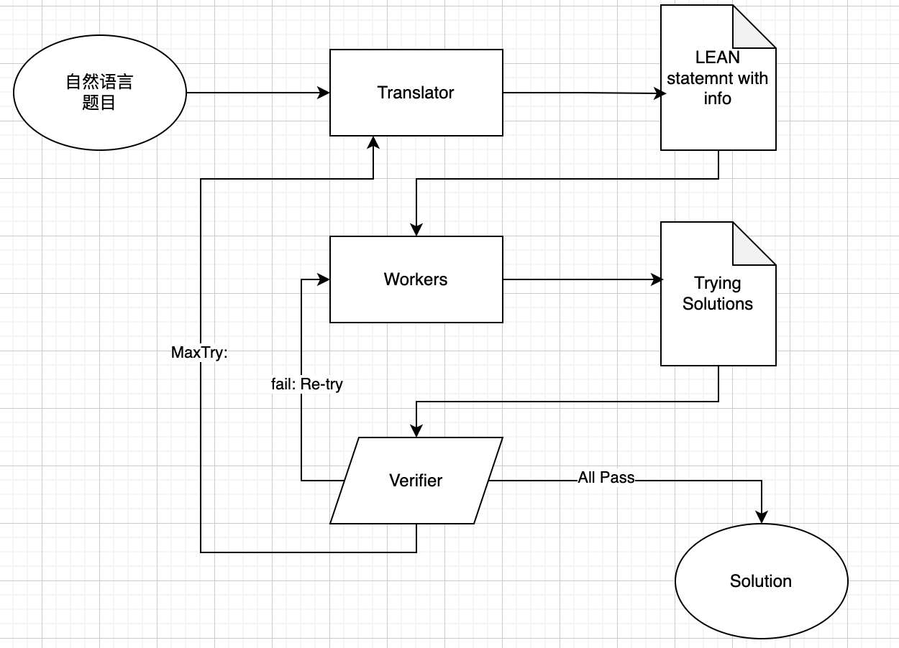

# LLL

## Overview 


Description: :sorry

## Tasks

### Math Problem Translator

#### Description

开发一个基于可选择基础模型的自然语言到Lean 4代码转换器，该工具能够将数学问题的自然语言描述转换为形式化的Lean 4代码表示，并自动生成相关的证明策略（tactics）命名空间和难度评估信息。系统应支持多种基础模型，并提供清晰的JSON接口用于交互。

#### Methods

**Input**
```json
{
  "model": "gpt-4", // 可选模型: gpt-4, llama-3, mistral等
  "problem_type": "theorem", // 问题类型: theorem, lemma, definition, example
  "natural_language": "Prove that the sum of two even numbers is always even.", // 自然语言数学题
  "options": {
    "include_tactics": true, // 是否生成证明策略
    "include_difficulty": true, // 是否评估难度
    "lean_version": "lean4#nightly", // 指定Lean版本
    "inference_mode": "auto" // 推断模式: auto, strict, relaxed
  }
}
```

**Output**
```json
{
  "status": "success",
  "timestamp": "2025-05-20T12:00:00Z",
  "input": { ... }, // 复制输入内容
  "output": {
    "lean_code": "theorem even_add_even (a b : ℕ) (ha : even a) (hb : even b) : even (a + b) :=\n  sorry", // 生成的Lean 4代码
    "namespace": "tactic.math_translator", // 策略命名空间
    "tactics": ["cases", "rewrite", "use", "exact"], // 推荐的证明策略
    "difficulty": {
      "level": "intermediate", // 难度级别: beginner, intermediate, advanced
      "complexity_score": 6.2, // 复杂度评分(0-10)
      "estimated_time": "15-30 minutes" // 估计解决时间
    },
    "dependencies": ["mathlib.data.nat.basic", "mathlib.tactic.ring"], // 自动推断的依赖库
    "context": ["number_theory", "algebra"], // 自动识别的数学上下文
    "hints": ["Consider the definition of even numbers.", "Use induction on a and b."] // 提示信息
  },
  "metadata": { ... } // 与之前相同的元数据
}
```

#### Requirements
1. model 名字匹配；不符合需要返回错误信息；  可在OUTPUT中添加： "status": "error",

2. 完成后，需要提供API调用方式，记录在secret tanslator.json中

## Tasks

### Lean 4 Verification Service

#### Description

开发一个基于Docker的Lean 4验证服务，该服务通过API接收JSON格式的Lean 4语句，执行验证，并返回验证结果。服务应具备以下特性：
- 使用Docker容器化部署Lean 4环境
- 提供RESTful API接口处理验证请求
- 支持批量验证多个Lean 4语句
- 返回结构化的验证结果（成功/失败、错误位置、类型检查信息等）
- 确保服务的稳定性和安全性

#### Methods

**Input**
```json
{
  "statements": [
    "def add (a b : ℕ) : ℕ := a + b",
    "theorem add_comm (a b : ℕ) : add a b = add b a := by sorry"
  ],
  "options": {
    "timeout": 10,          // 单条语句验证超时时间（秒）
    "lean_version": "lean4#nightly",  // 指定Lean版本
    "dependencies": ["mathlib"]       // 依赖的库
  }
}

** 


